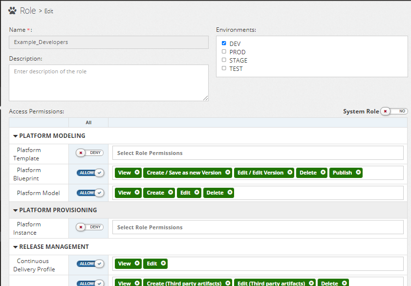

# 1 Connecting Myst to an Active Directory Domain

## 1.1 Add the Active Directory Provider

1. Login as an Administrator and go to **Administration** -> **Users**

3. Click  and fill in the details.


| Name                 | Value                                     |
|----------------------|-------------------------------------------|
|**Connection**|---------------------------------------------------|
| Host                 | `myst.ad.local`                           |
| Port                 | `636`                                     |
| Secure (SSL)         | `Yes`                                |
| Principal            | `cn=admin,dc=mystsoftware,dc=com`         |
| Credential           | `Welcome1`                                |
|**Users**|----------------------------------------------------|
| User Base DN         | `ou=users,o=myst,dc=mystsoftware,dc=com`  |
| User Name Attribute  | `cn`                                      |
| User Object Class    | `person`                                  |
| All Users Filter    | `(&(cn=*)(objectClass=person)(mail=myst))` |
|**Groups**|----------------------------------------------------|
| Groups Base DN       | `ou=groups,o=myst,dc=mystsoftware,dc=com` |
| Group Name Attribute | `cn`                                      |
| Group Object Class   | `groupOfNames`                            |
| Member DN Attribute  | `member`                                  |
| All Groups Filter    | <code>(&(cn=*)(mail=myst)(&#124;(objectclass=groupofNames)(objectclass=orcldynamicgroup)))</code>       |


## 1.2 SSL Configuration (LDAPS)

If the connection uses LDAPS then Myst Studio must trust the certificate chain. In this Docker example we can volume mount the `keystore` directory or the file.

#### 1.2.1 Troubleshooting General or SSL Connectivity 

If there are issues connecting Myst to LDAPS try the following:

1. First, check the Docker container logs `docker logs -f myststudio_web`

2. Additionally try appending `-Djavax.net.debug=ssl` to `CATALINA_OPTS` for SSL debug logging also seen in `docker logs -f myststudio_web`


#### 1.2.2 Importing the Active Directory Certificate Chain

Create a `trust.jks` containing the Active Directory server's certificate chain.

1. Obtain the certificate chain
   `openssl s_client -connect <AD_HOST>:636 -showcerts`
2. Save certificate(s)
   from `-----BEGIN CERTIFICATE-----` to `-----END CERTIFICATE-----` (inclusive)
3. Import certificates into the trust keystore `trust.jks`
   `keytool -importcert -noprompt -keystore "trust.jks" -storepass "changeit" -trustcacerts -alias "my_rootca" -file my_ca.cer`
   `keytool -importcert -noprompt -keystore "trust.jks" -storepass "changeit" -trustcacerts -alias "my_server"  -file my_server.cer`
4. Copy  `trust.jks` to a location planned for Docker's volume mounting


#### 1.2.3 Setup Myst docker-compose.yml

Configure Myst to use the trust keystore.

* Configure Docker `volumes` to mount the JKS
* Configure Tomcat `CATALINA_OPTS` to keystore location and password
* Restart the Docker container

Example of `docker-compose.yml`.

```yaml
version: '2'
services:
  web:
    ...
    volumes:
     - ./data/license:/usr/local/tomcat/conf/fusioncloud/license
     - ./data/ext:/usr/local/tomcat/conf/fusioncloud/ext
     - ./data/keystores:/usr/local/tomcat/conf/fusioncloud/keystores            # Mount directory
    #- ./data/keystores:/usr/local/tomcat/conf/fusioncloud/keystores/trust.jks  # Mount file
    ...
    
    environment:
    CATALINA_OPTS: "-Xmx2048m -Xms2048m -Djavax.net.ssl.trustStore=/usr/local/tomcat/conf/fusioncloud/keystores/trust.jks -Djavax.net.ssl.trustStorePassword=Welcome1"
    TZ: "Australia/Brisbane"
    ...
```

Example of the `docker run` command.

```shell
docker run -d \
  --name myststudio_web \
  -v ./data/keystores:/usr/local/tomcat/conf/fusioncloud/keystores \
  -e CATALINA_OPTS="-Xmx2048m -Xms2048m -Djavax.net.ssl.trustStore=/usr/local/tomcat/conf/fusioncloud/keystores/trust.jks -Djavax.net.ssl.trustStorePassword=Welcome1"
...
```

*NOTE: Each example is an incomplete snippet with the `...` representing further configuration.*


# 2. Configure the Roles

When Active Directory (AD) is integrated with Myst the AD groups synchronise.
* The default workspace will be populated with **Users**
* **Users** will be placed in their respective **Roles**


### 2.1 Roles

Add permissions to the new **Roles** synchronised from Active Directory.




### 2.2 System Role

Similar to Myst Roles, the Myst **System** Roles can be configured and later assigned to users.


# 3. Add New Users in Active Directory

New users into Active Directory will automatically synchronise with Myst on login. The user will be assigned to the **Default** workspace and associated to their role.

1. Add new user to Active Directory along with their group
2. User logs into Myst
   1. Myst automatically synchronises the user and their role(s) based on the AD group
   2. Myst synchronises to the **Default** (`6fafeb5a-0bcb-4683-8f57-e287ea7eebaf`) workspace


# 4. Known Issues and Limitations

Log any issues or improvements to [https://rubiconred.freshdesk.com/](https://rubiconred.freshdesk.com/).


## 4.1 Synchronisation

### 4.1.1 Deleting Users from Active Directory

###### Potential Use Case

User leaves team or company.

###### Issue

FC-6609 - Myst does not synchronise deleted users.

###### Workaround

Delete the user manually via Myst.

### 4.1.2 Moving a User to a different group

###### Use Case

User changes team.

###### Issue

FC-6612 - Changing a User to a different group does not synchronise in Myst. The user will remain in the same role.

###### Workaround

Manually change the user in Myst to the desired role.

### 4.1.3 Changing the User and Group filters

###### Potential Use Case

Myst admin incorrectly applies a filter and wants to apply a new filter.

###### Issue

FC-6612 - Changing the User and Group filter does not remove existing Myst users and roles. Users and Groups in the new filter will added into Myst.

###### Workaround

Manually delete users and groups that should be filtered out.

### 4.1.4 Synchronises to Myst 'Default' workspace

###### Potential Use Case

Multiple workspaces are created where different resources and users are assigned.

###### Issue

FC-6613 - Allow a configurable default workspace along with a configurable Active Directory attribute.

###### Workaround

Manually delete the users and roles from the Default workspace and assign to the preferred workspace.


## 4.2 Connection

### 4.2.1 No UI feedback if Myst cannot connect

###### Issue

FC-6610 - No error when Myst fails connecting to Active Directory.

###### Workaround

Check the Myst Studio docker container logs for errors.

### 4.2.2 Unable to disable the connection to Active Directory

###### Issue

FC-6611 - No ability to disable AD integration.

###### Workaround

Use an invalid hostname in the Myst provider configuration to prevent further connections to Active Directory.

