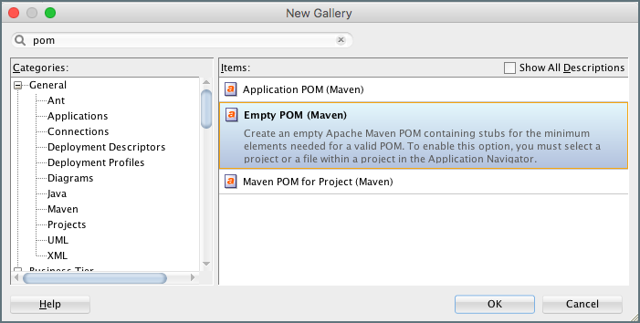
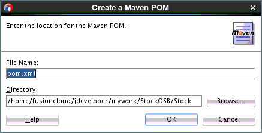

## {{ page.title }}

Maven is a build automation tool initially developed for Java projects. It has become the default build tool for Oracle Middleware.

Maven addresses two aspects of the build process; first, it describes how to build the software, and second, it describes any build time dependencies.

The Project Object Model or POM is an XML File that provides all the configuration information required by Maven for the build, such as the software project being built, its dependencies on other external modules and components, the build order, directories, and required plug-ins. 

For each artifact that we wish to build, we need to create a corresponding POM file. Once created, we need to commit that to our Version Control System so that we can perform automated builds from our CI Server.

### Populating Binary Repository with Maven plugin

The Oracle Maven Synchronization plugin supports populating local and remote repositories with artifacts from a given Oracle Middleware installation. Detailed instructions are available in the [Oracle documentation](https://docs.oracle.com/middleware/1221/core/MAVEN/config_maven.htm#MAVEN311) on how to setup your Binary repository. 


You must perform the one-off synchonization step in your local environment or Continuous Integration server before you can build Oracle SOA and related artifacts using Maven.


Sample commands are shown below. 

#### Seeding a local repository

This is useful for a basic local build setup.

Update the values of **ORACLE_HOME** to suit the target environment.

```
export ORACLE_HOME=/opt/app/oracle/product/fmw1221

mvn install:install-file \
-Dfile=${ORACLE_HOME}/oracle_common/plugins/maven/com/oracle/maven/oracle-maven-sync/12.2.1/oracle-maven-sync-12.2.1.jar \
-DpomFile=${ORACLE_HOME}/oracle_common/plugins/maven/com/oracle/maven/oracle-maven-sync/12.2.1/oracle-maven-sync-12.2.1.pom

mvn com.oracle.maven:oracle-maven-sync:push \
-DoracleHome=${ORACLE_HOME} -DtestingOnly=false 

```

#### Seeding a remote repository

This approach is recommended for a Continuous Integration server and/or a team of developers. When a build is run on any server with the same Maven `settings.xml` the required libraries will be automatically downloaded if they are missing.

Update the values of **ORACLE_HOME**, and **MAVEN_SERVER** to suit the target environment. Note: This command could take up to 2 hours to complete, depending on network performance.

```
export ORACLE_HOME=/opt/app/oracle/product/fmw1221

mvn deploy:deploy-file \
-Dfile=${ORACLE_HOME}/oracle_common/plugins/maven/com/oracle/maven/oracle-maven-sync/12.2.1/oracle-maven-sync-12.2.1.jar \
-DpomFile=${ORACLE_HOME}/oracle_common/plugins/maven/com/oracle/maven/oracle-maven-sync/12.2.1/oracle-maven-sync-12.2.1.pom \
-Durl=http://${MAVEN_SERVER}:8081/artifactory/ext-release-local/ -DrepositoryId=artifactory

mvn com.oracle.maven:oracle-maven-sync:push \
-DoracleHome=${ORACLE_HOME} -DtestingOnly=false -DserverId=artifactory

```

For the above to work, you should define your Maven Repository connection details in the Maven `settings.xml`. Below is an example for Artifactory.
```
<?xml version="1.0" encoding="UTF-8"?>
<settings xmlns="http://maven.apache.org/SETTINGS/1.1.0"
          xmlns:xsi="http://www.w3.org/2001/XMLSchema-instance"
          xsi:schemaLocation="http://maven.apache.org/SETTINGS/1.1.0 http://maven.apache.org/xsd/settings-1.1.0.xsd">
  <servers>	
    <server>  
      <username>admin</username>  
      <password>password</password>  
      <id>artifactory</id>  
    </server>  
  </servers>
  <profiles>
	<profile>
	  <id>oracle-repo</id>			  
	  <properties>
	     <oracleHome>/opt/app/oracle/product/fmw1221</oracleHome>
	  </properties>
	  <repositories>		
		<repository>
		  <id>artifactory</id>
		  <name>artifactory</name>
		  <url>http://localhost:8081/artifactory/ext-release-local</url>
		  <layout>default</layout>
          <snapshots>
             <enabled>false</enabled>
          </snapshots>
          <releases>
            <updatePolicy>never</updatePolicy>
          </releases>
		</repository>
	  </repositories>
	</profile>
  </profiles>
  <activeProfiles>
    <activeProfile>oracle-repo</activeProfile>
  </activeProfiles>

</settings>

```

### Defining our Project Object Model

Each automated Maven build should have a Project Object Model (also knows as `pom`) which is defined in a `pom.xml` file at the project root directory.

At a minimum a `pom.xml` must contain a `groupId`, `artifactId` and `version` (also known as a GAV classifier) and a `modelVersion` to indicate the version of the Maven Project Object Model itself. At the time of writing, `4.0.0` is the latest `pom` version.

Below is an example of the most minimal `pom.xml` to create a single jar file

```
<project>
 <modelVersion>4.0.0</modelVersion>
 <groupId>com.acme</groupId>
 <artifactId>my-jar-achive</artifactId>
 <version>1.0-SNAPSHOT</version>
</project>
```

Given this `pom.xml` and a source code structure as follows...
```
hello-world
├── pom.xml
└── src
    └── main
        └── java
            └── com
                └── acme
                    └── hello_world
                        └── Main.java

6 directories, 2 files
```
...when I navigate to the `hello-world` project directory from a Terminal and execute `mvn package` then a Java Archive will be compiled and packaged to `target/hello-world-1.0-SNAPSHOT.jar`

#### Maven Parents

Maven supports the concept of project inheritance. This can be useful when you want to have a common set of properties and plugins that are reused by multiple projects. This is also the mechanism that Oracle use to enable a given `pom.xml` to build a certain project type. 

Project inheritance is achieved through the concept of a **Parent POM** which is in-turn referenced by the **Project POM**. Below is an example `pom.xml` for building an Oracle Service Bus (OSB) archive for the 12.2.1.0.0 version of Oracle SOA Suite.

```
<project>
  
  <modelVersion>4.0.0</modelVersion>
  <parent>
    <groupId>com.oracle.servicebus</groupId>
    <artifactId>sbar-project-common</artifactId>
    <version>12.1.3-0-0</version>
  </parent>
  <groupId>com.acme</groupId>
  <artifactId>stock-services</artifactId>
  <version>1.0-SNAPSHOT</version>
  <packaging>sbar</packaging>
</project>
```

In addition to the automated build, the MyST build plugin will use the `parent` for Oracle-specific artifacts to determine the deploy-time Artifact Type. This is important as MyST uses different deploy-time strategies depending on the Artifact Type.

The below table contains the details of common Parent POMs provided by Oracle and their corresponding MyST Artifact Type.

| MyST Artifact Type | Group ID | Artifact ID | Support Versions |
| ------------------ | ------- | ---------- | -------- |
| ADF | com.oracle.adf | adf-parent | 12.1.3-0-0, 12.2.1-0-0 |
| SOA/BPM Composites | com.oracle.soa | sar-common | 12.1.3-0-0, 12.2.1-0-0 |
| OSB Configuration | com.oracle.servicebus | sbar-project-common | 12.1.3-0-0, 12.2.1-0-0 |

### JDeveloper Examples

Oracle JDeveloper 12c has native support for Apache Maven.

#### Building Oracle Service Bus Projects in JDeveloper with Maven

In this section, we provide a detailed walkthrough on how to create a POM file in JDeveloper. In this example, we will show how to create a POM file for an OSB project. A similar approach would also be used for other artifact types.

Within JDeveloper, locate the OSB project that we wish to build with Maven. Right click on the project and click `New` and then select `From Gallery`.


Type `pom` into the Search Bar and then select `Empty POM (Maven)`.



Click `OK`. JDeveloper will open the `Create a Maven POM` dialogue. Leave the defaults when prompted to enter the location and click `Ok`.



If prompted to overwrite an existing file, select `Yes`.


JDeveloper will then prompt us to enter the following values:
* **Group Id:** The groupId for your new project. This usually starts with your organization's domain name in reverse format. For example `com.acme`.
* **Artifact Id:** The artifactId for your OSB project. This is usually an identifier for this project.
* **Version:** The version for our OSB project. This is usually 1.0-SNAPSHOT for a new project.
* **Packaging** - This must be set to `sbar`
* **Parent > Group Id** - This must be set to `com.oracle.servicebus
`.
* **Parent > Artifact Id** - This must be set to `sbar-project-common`.
* **Parent > Version** - This must be set to the version of the Oracle Service Bus, for example, 12.1.3-0-0 or 12.2.1-0-0.


Click on the Source tab. The source should look similar to the following:
```
<?xml version="1.0" encoding="UTF-8"?>
<project xmlns="http://maven.apache.org/POM/4.0.0">
    <modelVersion>4.0.0</modelVersion>
    <groupId>com.acme</groupId>
    <artifactId>StockServices</artifactId>
    <version>1.0-SNAPSHOT</version>
    <packaging>sbar</packaging>
    <parent>
        <groupId>com.oracle.servicebus</groupId>
        <artifactId>sbar-project-common</artifactId>
        <version>12.2.1-0-0</version>
    </parent>
</project>
```

Once completed, save the POM.

> When creating a POM for a different artifact type, we will need to specify the appropriate **packaging** and parent **groupId**, **artifactId** and **version**. For further details, refer to the Oracle [Documentation](https://docs.oracle.com/middleware/1221/core/MAVEN/toc.htm).

#### Test Maven Build
Prior to configuring our CI Server to automatically executing our Maven build, it is good practice to test that we have correctly configured our POM file by executing the Maven build from within JDeveloper.

Right-click on the project and click `Run Maven` then `package`.


We should see the Maven build running in the `Apache Maven - package` tab.
 Once the build has completed successfully, the output should look similar to the following.


Navigate to the folder .data/maven on the file system under the project home. You should see a file created called `sbconfig.sbar`.

> Once we have created our Project Object Model (pom.xml). We **must** commit it to our Version Control System so that we can perform automated builds from our CI Server.

