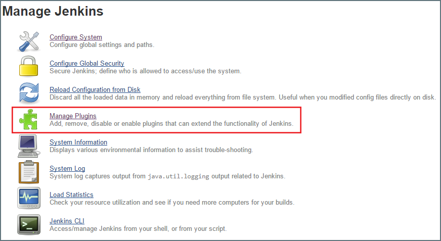
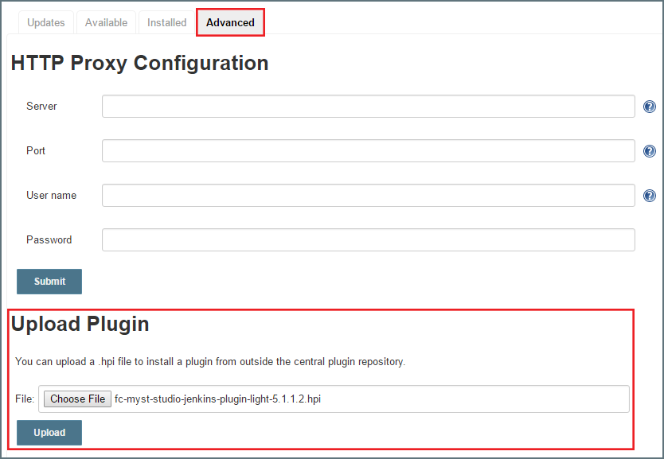

## {{ page.title }}

As part of the build process, we require Jenkins to publish details of each artifact build to Myst Studio. We have two options to install and configure:

1. The **Myst Studio plugin for Jenkins**
2. The **Myst Studio Transport JAR**

### Install Myst Studio Plugin for Jenkins

1. Download the Myst Studio Plugin for Jenkins (hpi). Ensure that the version of the plugin selected is the same as the version of Myst Studio being used.
2. Log into Jenkins and select `Manage Jenkins`
    
3. Next, select `Manage Plugins` and select the `Advanced` tab. Scroll down to the `Upload Plugin` section. Click on `Choose File` and browse to and select the plugin that we downloaded in the previous step.
    
4. Jenkins will upload and install the plugin. We will need to restart our Jenkins instance once the plugin has been uploaded.
5. After restarting Jenkins, to validate that the plugin has been successfully installed, go to the `Manage Plugins` page and select the `Installed` tab.
6. Enter `myst` in the `Filter` criteria and we should be able to see the installed Myst plugin as shown below.
    

#### Configure Myst Plugin

1. Go to Jenkins, click on `Manage Jenkins` > `Configure System`.
2. Scroll down to the **Myst Studio Configuration** section and enter the following information:
  * **Studio Endpoint** - URL for Myst Studio and takes the format `http://<myst-server-url>:<server-port>`. The default server port is 8085.
  * **API Token** - This token is used to authorize communication between Jenkins and Myst Studio and is the API Key that we obtained from [Myst API Key](/administration/management/api_key.md).
    
3. Next, click `Connect`. If the connection is successful, the message `Connected successfully` will be displayed.
4. Click `Save`
