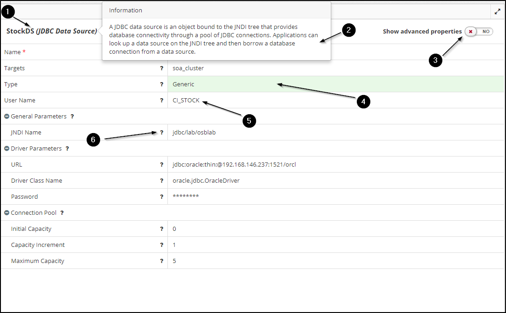
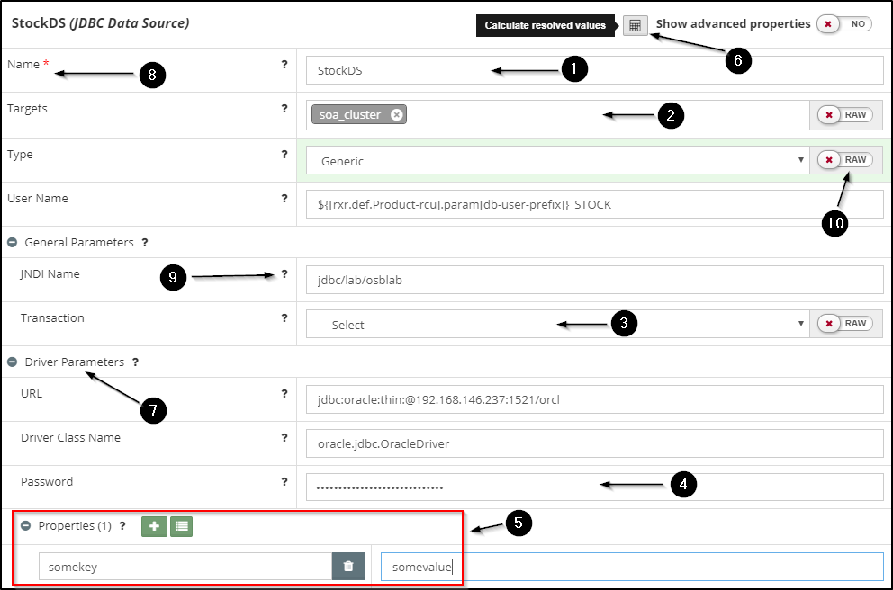
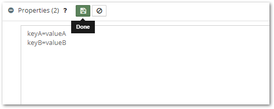
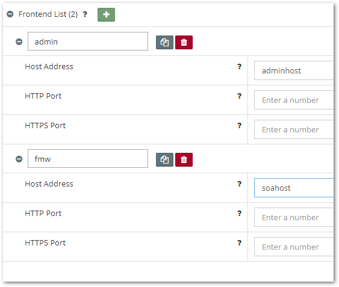

## {{ page.title }}

The Properties View displays the list of properties and corresponding values defined for the selected component in the [Tree View](/platform/definitions/editor/tree-view/README.md). It allows one to view as well as change configuration for individual attributes of a component.

These attributes may just be simple types such as text values, numbers, enumerations, etc. but can also themselves be quite complex structures such as lists and maps.

The view changes significantly based on whether it is seen in `view mode` or `edit mode`. Hence, each of these modes and the constructs within them are described in separate sections below.

### View Mode

The `view mode` is for viewing the properties and their values. It only shows those properties whose values have been set and not the entire set of properties that are available for the component being viewed.

The different components of the property view are numbered in the image above. We will now explain what they mean and how each one can be used.

1. **Component Title** - This is a read-only title for the component which quickly helps us understand what it is. It normally consists of the name of the component and the type of it. 

 In case there can be only one component of a particular type, the name attribute is omitted and only the type of the component is displayed which is sufficient to explain what it is.

 Above, we can see that the component is a `JDBC Data Source` with name `StockDS`.

2. **Component Help** - On clicking on the component title, a popover is shown providing contextual help about it. This can help those who have previously not worked with this component in terms of understanding what it represents and how they can use it. 

3. **Advanced Mode** - A switch which if turned on, will display those properties which are earmarked as `advanced`. Advanced properties are those which normally are not shown to the user as most often they would not be configuring these.

 So, having the switch set to off would show lesser configuration to the user and hence reduces visual noise by hiding the lesser used properties.

 > Once the switch is turned on, Myst remembers the setting for the current session and it will continue to stay on even when the user navigates to other components.

4. **Auto-Computed Properties** - Any property value shown in a green background represents something which Myst has automatically computed and that which the user has not explicitly defined / overriden. For example, in the image, the type of the data source is auto-computed by Myst as `Generic`.

 The way Myst does this computation is based on various aspects. The most common among these is to rely on the basic information supplied by the user and guessing other configuration based on it. Other aspects include compliance with the Oracle Enterprise Deployment Guide, best practices learnt over time by working with different customer environments, etc.

  
 All other properties whose values are shown in white represent user-defined properties. These also include those where Myst had computed an initial value but the the user chose to override it with his own value.
 

5. **Resolved Values** - When viewing properties, Myst shows the `resolved value` for it. If we hover over the value we will also see something called the `raw value` for the property. Myst only persists the `raw value` and while displaying shows the `resolved value`. 

 

 In most cases, the resolved value and the raw value will be identical. However, the instances where these will be different are:

    a. When we have defined the original value using property references. In such cases, Myst expands the references and show the final value after expansion as the `resolved value`. Property references are explained in more depth [here](/platform/definitions/editor/property-reference/README.md).
     
    b. Boolean fields, drop-downs etc. In such cases, it is possible that the value shown as `resolved value` is just a display label whereas the `raw value` is the actual key. e.g. `Yes` might be shown as the `resolved value` whereas the actual `raw value` might be `true`. 

6. **Property Help** - Clicking on the question-mark sign (`?`) besides each property name shows a popover containing helpful information about it. 

 

 This can help those who have previously not worked with this property in terms of understanding what it represents and how they can use / specify it.

### Edit Mode

The `edit mode` is for editing the properties and their values. It shows the entire set of properties that are available for the component being edited and guides us so that we can enter suitable values for each one of them.

The different components of the property view in `edit mode` are numbered in the image above. We will now explain what they mean and how each one can be used. Note that the ones we already covered while describing the `view mode` are omitted here.

1. **Simple Textual Property** - The most basic form of capturing value for a property is by providing a `simple text` box. We just type in the desired value for out property into this box as shown in the image. These properties can be further split into three variations.

 A variation of this is the `number` property which shows a text box restricted to typing in integer values. 

2. **Relationship Property** - Often, we need to establish relationships between different components. The relationships could be one-to-one or one-to-many. In Myst, these relationships are also captured through property values.

 As shown in the image, here a `JDBC Data Source` has to specify the WebLogic clusters / servers where it needs to be targeted to. For this, it has a `Targets` property which presents a multi-select drop-down of clusters and servers based on the configuration and we have chosen `soa_cluster` from the available options.

 

3. **Enum Property** - Many properties are restricted to a limited set of allowed values. For this, Myst has enum properties which allows us to choose from a pre-defined list of options.

 An often used form of this is the `boolean` property which shows a simple dropdown with `Yes` and `No` options which when chosen results in Myst storing either `true` or `false` as the property value.

 

4. **Password Property** - As suggested by the name, these are properties whose values are sensitive and hence are captured as password fields. Myst stores values for such properties in an encrypted format.

5. **Key-Value Property** - These properties allow us to specify values in a `map` like format where we can define multiple keys and their corresponding values. 

 

 To add a new key, we should click on the `+` button. This will add a new row and allow us to fill in values for both the key and its corresponding value.

 We can also delete already added key-value pairs using the `Delete` button against each of them.

 Sometimes, it is more convenient to edit these key-value pairs in bulk when the number of such pairs is high or when we need to easily copy and paste from a properties file for example. To allow this, we can click on the green `Bulk Edit` button which will switch the editor into a `text-area` view such as below

 

 After making all changes inside this text-area, we should click on `Done` and we will be taken back to the original mode. 

6. **Calculate Resolved Values** - By default, Myst wont show the resolved values for every property. To display the resolved values at any time, we can click on the `Calculate resolved values` button. This will result in all resolved values showing up below the input values. 

 

 In this context, `resolved value` means the final value that is going to be used by Myst when it configures the platform.

 In the image above, the data source type `Generic` resolves to `generic` in lower case as this is the actual value that Myst is going to use while configuring the data source.

 Another example is where the value has property references. In the image above, the database user property had a property reference `${[rxr.def.Product-rcu].param[db-user-prefix]}` which resolved to the value, `CI`, hence resulting in the value `CI_STOCK`. As before, this indicate that `CI_STOCK` is the value that is going to be used by Myst when it configures the data source.

7. **Complex Properties** - As we told earlier, properties need not always be only simple types. Just as we saw examples of `map`style properties, we can also have `object` and `list` style properties.

 In the image above, `Driver Parameters` is an `object` style property which has other sub-properties within it.

 

 The image above is an example of a `list` style property. We can add items onto the list with an identifier for each of them. Each item in a list is itself an `object` style property which can again contain sub-properties as before.

 > Note that complex properties can be at any level of depth.

8. **Mandatory Properties** - For every component, there may be some properties which are mandatory and whose values have to be filled in before committing.

 

 If a mandatory property is left empty, Myst will show a validation error below it. However, Myst wont actually stop us from saving the configuration.

 This is because there might be instances where one wants to just save draft configuration without actually committing it and to allow for this, Myst prompts us but still allows to save.

 
 Currently Myst does not do any mandatory property validations on a `commit`. In future, Myst may do validation of such configuration and prompt the user to fill in the values for all the missing properties.
 

9. **Property Help** - This is exactly same as described for the `view mode` with an exception. Here, the popover not only shows help text for the property but also shows an expression which can be used to reference the property in other places.

 

 In the image above, we can notice the `Expression` for the property. Using the `copy` button (outlined in red), we can also easily copy this expression to clipboard and then paste it wherever we need to reference it. To understand more about property references, see [Using Property References](/platform/definitions/editor/property-reference/README.md)

10. **Raw Mode Switch** - This allows us to toggle between the displayed value / options and the actual raw value that Myst will store. This may prove to be quite useful in cases where we feel that the options Myst has presented are inadequate or in cases where we may want to use property references instead of choosing from the options.

 
 

 See above how when the `Raw` switch is turned on, Myst shows a text box with the actual raw value, `generic` instead of the display label `Generic`. We can now go ahead and change this to any value we want, irrespective of whether or not it is a part of the allowed options.

 
 In cases where we have entered a `raw value` which does not match any of the provided options and we wish to turn the `Raw` mode off, Myst will prompt us with a message asking us to decide whether we want to reset our value to what it was before or just stay on in the `Raw` mode.

 This is to prevent us from accidentally switching the `Raw` mode off and losing what we explictly entered as the value. It is a conscious choice that has to be made by us.

 **Relationships** - For relationships, Myst automatically tries to use property references as the `raw value`.

 
 

 See how in the example above, Myst tries to keep a property reference as the raw value instead of the literal value, `soa_cluster`.

 This is because even if someone goes ahead and changes the name of the cluster in future, the property value here would reflect the new name automatically rather than breaking the established relationship. 