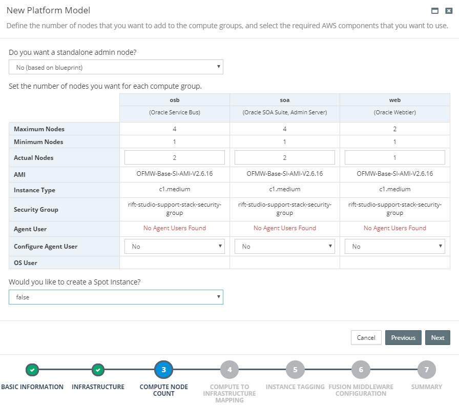
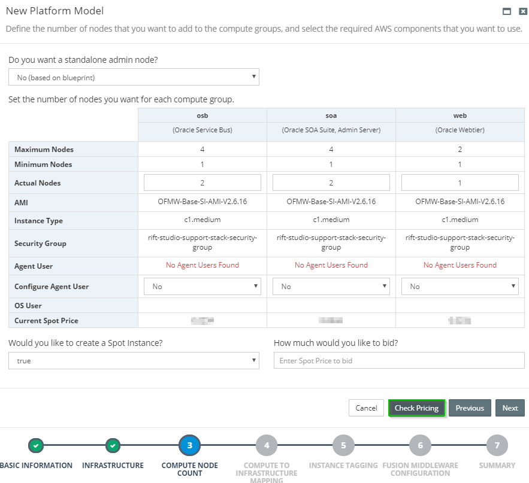
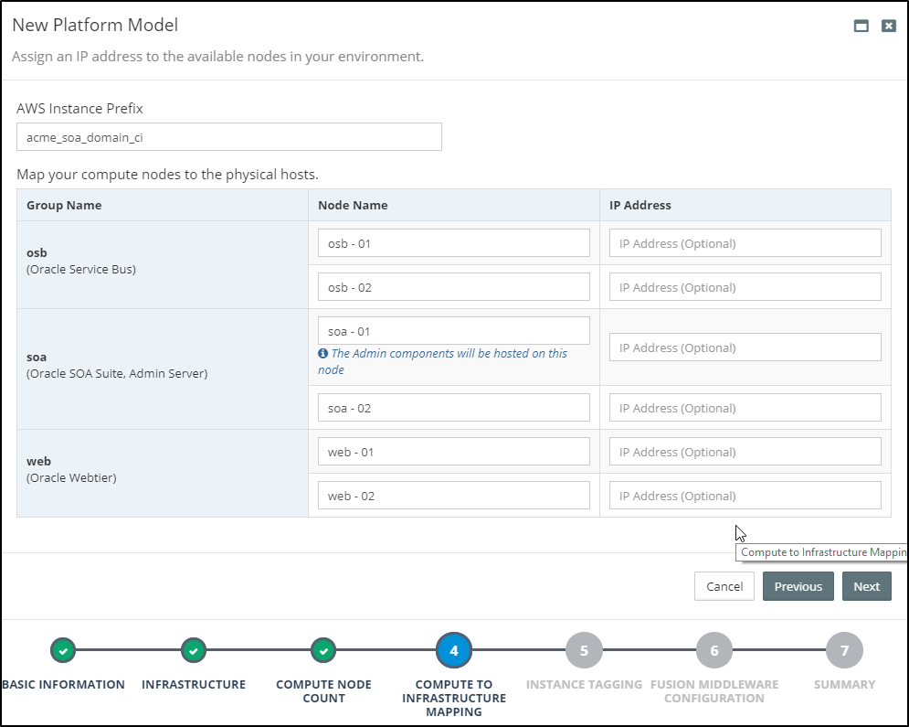
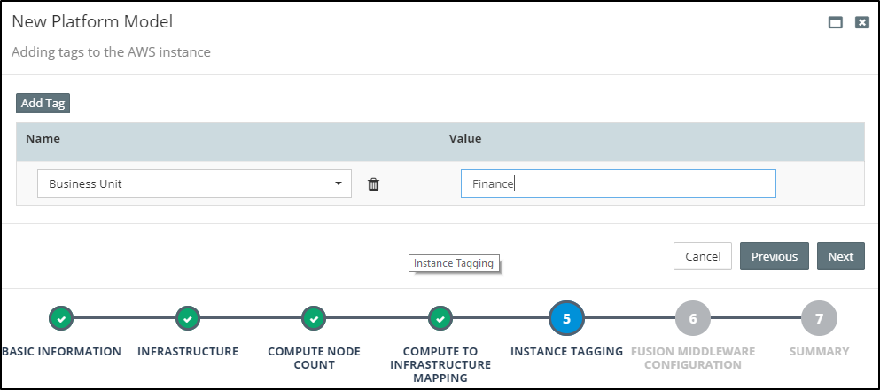
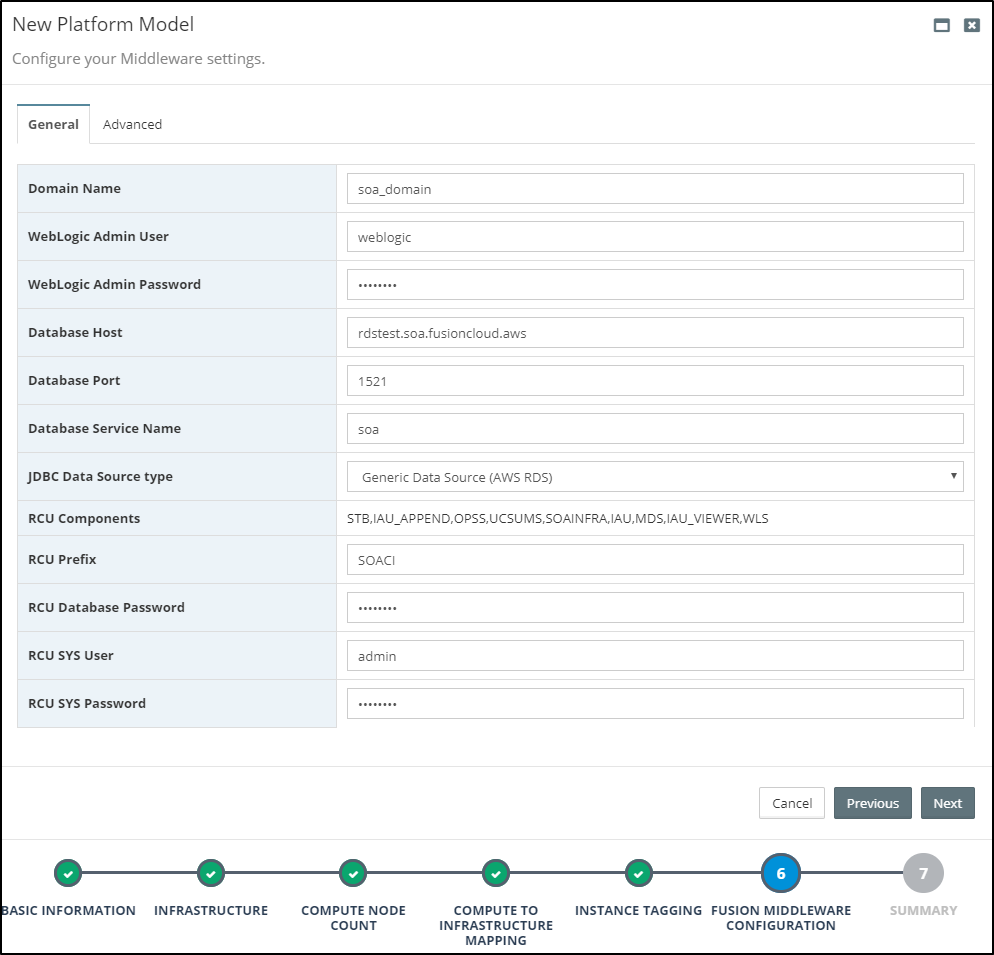
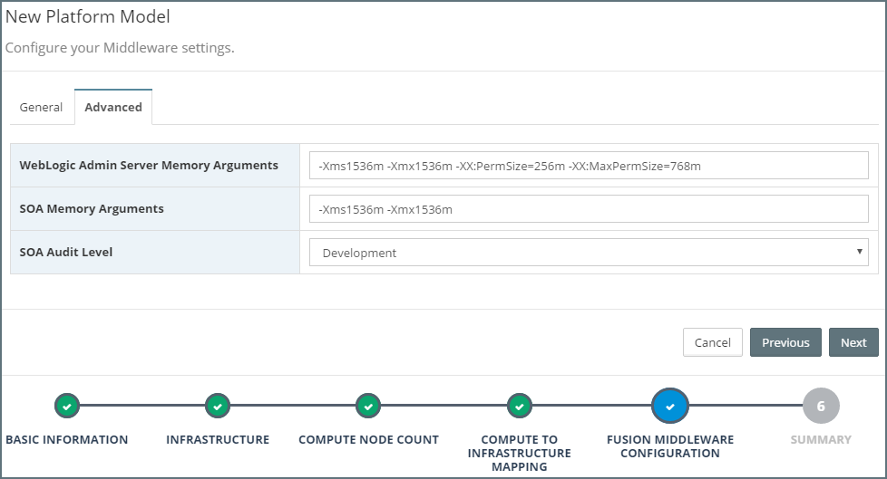
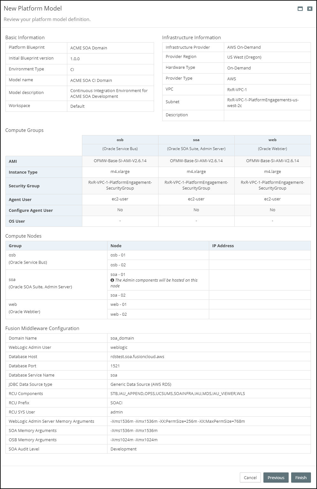

## Creating a Platform Model for AWS On Demand

From the side menu navigate to`Modeling` > `Platform Model`, this will display a list of existing Platform Models. Click on `Create New` in the top right-hand corner of the screen. This will launch the `New Platform Model` wizard.

In the initial dialog, we need to specify the following details about our Platform Model:

* **Platform Blueprint** - The Platform Blueprint that we will use for our Platform Model.

* **Platform Blueprint Version** - The version of the Platform Blueprint that we will use for our Platform Model.

* **Environment Type** - The Environment Type for the Platform Model.

* **Name** - Shorthand name for the Platform Model.

* **Description** - A longer description of the Platform Model

* **Workspaces** - This defines the Workspaces to which the Platform Model belongs. See Role-Based Access Control for further details.

Once we have entered the basic details about our Platform Model click `Next`.

### Select Infrastructure Provider

Next, we need to specify the Infrastructure Provider for our Platform Model. From the corresponding drop-down, select Infrastructure Provider of type `AWS On-Demand`.

In the initial dialog, we need to specify the following details about our Platform Model:

* **Virtual Private Cloud (VPC)** - From the corresponding drop-down, select the VPC that you wish to provision your Platform Instance on.

* **Subnet** - From the corresponding drop-down, select the Subnet that you wish to provision your Platform Instance on.

> Note: The available VPCs and Subnets are those configured as part of setting up the AWS On-Demand Infrastructure. See [Configuring AWS On-Demand Infrastructure]() for further details.

Once done, click `Next`.

### Specify Compute Group
For each Compute Group defined within the Platform Blueprint we need to specify the following details:

* **Actual Nodes** - The number of compute nodes. This will initially be set to the default value within the Platform Blueprint but can be overridden in the Platform Model.

* **AMI**: This is the AMI (Amazon Machine Image) that will be used to create the EC2 instances. This will be automatically set based on the Compute Definition in the Platform Blueprint.

* **Instance Type** - This is the AWS EC2 Instance Type that will be used to create the EC2 instances. 

* **Security Group** - The security group which will be associated to the EC2 instance.

* **Agent User** - The user on the target host, which Myst will run as.

* **Spot Instance** - Amazon EC2 Spot Instances let you take advantage of unused EC2 capacity in the AWS cloud. Spot Instances are available at up to a 90% discount compared to On-Demand prices. You can use Spot Instances for various stateless, fault-tolerant, or flexible applications such as big data, containerized workloads, CI/CD, web servers, high-performance computing (HPC), and other test & development workloads.

> The available AMIs, EC2 Instance Types, Security Groups, Agent Users and OS Users are configured as part of the AWS On-Demand Infrastructure. Where multiple options are available, then a drop-down box is provided to select the required option. Where only a single option is available, then this value will be automatically set.

Below is the wizard when we select Spot Instance as false

Below is the wizard when we select Spot Instance as True.

Clicking Check Pricing button gives you the current running Bid price of required Spot Instance type at the moment.

In addition, we can also specify whether we want to have a stand-alone admin server, in which case it will be created within its own compute group. Myst will default to what is specified in the Platform Blueprint.

If we specified a stand-alone Admin Server in the Platform Blueprint, and then choose to override that, then we will also need to specify which compute group we want to target the Admin Server to.

Once done, click `Next`.

### Configure Compute Nodes
Once we have specified the number of nodes for each compute group, the next step is to configure the compute nodes.

We have the option of specifying an `AWS Instance Prefix`. If specified, the EC2 instance TAG `Name` of each compute node will be prefixed with this value.

For each compute node, in addition, we need to specify: 
* **Node Name** -  This is the name of the compute node within the WebLogic domain. The Compute Node Name will also be appended to the `AWS Instance Prefix` to define the EC2 TAG `Name` value for the EC2 instance.

* **IP Address** - The IP Address to be assigned to the EC2 instance. Usually, this is left empty, which means that AWS will automatically assign an IP address.

Once done, click `Next`.

### Tag your AWS instances
At this step you can optionally provide tags that will be associated with your AWS EC2 instances once they are provisioned.

Once done, click `Next`.

### Specify Platform Model Configurations

The final stage is to specify configuration properties that are specific to the Platform Model.

For the Platform Model, we need to specify the following details:

* **Domain Name** - This is the WebLogic Domain name, it will default to the value specified in the Platform Blueprint, but can be overridden in the Platform Model.
* **WebLogic Admin User** - Enter the WebLogic Admin user, it defaults to Weblogic.
* **Weblogic Admin Password** - Enter the password to be used for the WebLogic Admin User.
* **Database Host** - The host name for the database that will host the RCU schemas. 
* **Database Port** - The port number for the database.
* **Database Service Name** - The service name / SID of the database. 
* **JDBC Data Source type** - This option is used to specify the Data Source Type for Oracle Middleware specific schemas which are created by the Oracle Middleware Repository Creation Utility (RCU). If using AWS RDS Oracle for RCU, then select `Generic Datasource (AWS RDS)`.
* **RCU Components** - This details the RCU specific schemas that will be created. This is pre-populated based on the Oracle Middleware Components specified in the Platform Blueprint, this is for information purposes only and can't be modified.
* **RCU Prefix** - Specify the RCU Prefix to be used. The prefix is prepended to and separated from the schema name with an underscore (_) character.
* **RCU Database Password** Enter the password to be used for each of the schema owners created by RCU.
* **RCU SYS User** - Enter the user name for the RCU database. This should be a username with DBA or SYSDBA privileges, for example, SYS.
* **RCU SYS Password** - Enter the password for the RCU Sys User.

> Note: All passwords stored by Myst are encrypted.

#### GridLink and ONS nodes configuration
In case you are using a GridLink (RAC) database, you can specify the additional property, **ONS Nodes** and set specify the list of ONS nodes following standard Oracle documentation.

> Myst will auto-calculate the GridLink Database URLs as appropriate which you can change in the model editor later if you wish to override.

#### Override Default Memory and Logging Settings
It is common to have different JVM Memory Arguments and Logging configurations in upstream dev and test environments. The `Advanced` tab allows you override the settings in the Platform Blueprint.

For the Platform Model, we need to specify the following details:

* **WebLogic Admin Server Memory Arguments** - Allows you to specify the JVM Memory arguments for the WebLogic Admin Server.

* **WebLogic Managed Server Memory Arguments** - For each Oracle Middleware Component (for example SOA, OSB and OWSM), allows you to specify the JVM Memory arguments for the WebLogic Managed Server running that component.

* **Logging / Audit Levels for Oracle Middleware Components** - Allows you to specify the Logging / Audit Level for certain Oracle Middleware Components.

>> Note: The options available will be dependent on which Oracle Middleware components are included within the Platform Blueprint.

Once we have specified the `General` and `Advanced` Platform Model configurations, click `Next`.

### Review the Summary
Myst will display a Summary screen showing all the key inputs specified in the Platform Model Wizard.

Once done, click `Finish`. Myst will create the corresponding Platform Model and take you to the Platform Model Editor where you can make additional changes if required. See [Editing Platform Models](/platform/definitions/README.md) for further details.

